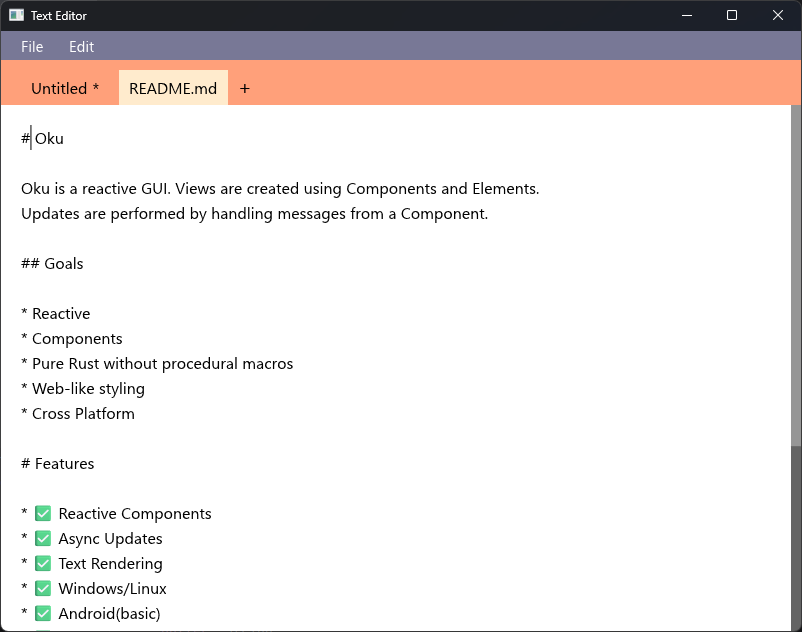
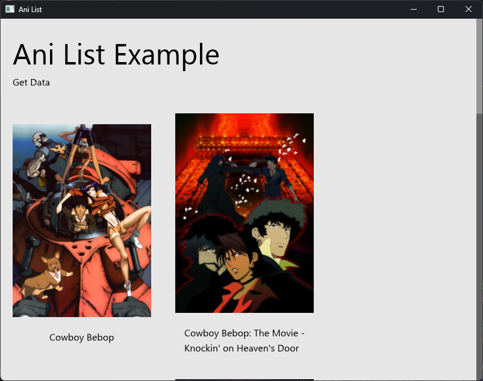
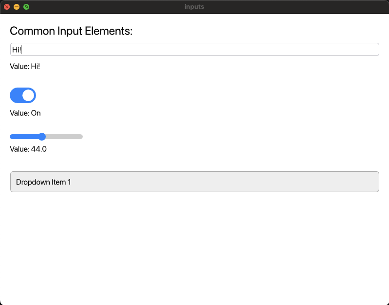
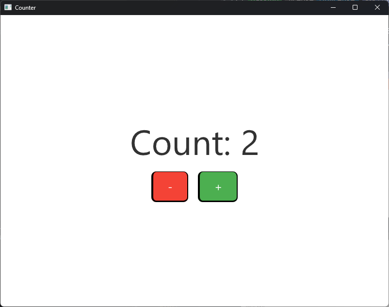

# 📜 Craft
[](https://github.com/craft-gui/craft/actions/workflows/ci.yml)
[](./LICENSE)

Craft is a reactive GUI. Views are created using Components and Elements.
Updates are performed by handling messages from a Component.

<p align="center">
  
  
</p>
<p align="center">
  
  
</p>

## Goals

* Reactive
* Components
* Pure Rust without procedural macros
* Web-like styling
* Cross Platform

# Features

* ✅ Reactive Components
* ✅ Async Updates
* ✅ Text Rendering
* ✅ Windows/Linux
* ✅ Android(basic)
* ✅ Web(basic)
* ✅ Image Support
* ✅ DPI Scaling Support
* ⬜️ Transform (Rotation, Skew, Scale) Support
* ✅ Mac
* ⬜️ iOS
* ✅ Text Input (Basic)
* ✅ IME Support (Basic)
* ⬜️ Animations
* ✅ Scrollables (Basic)
* ⬜️ Documentation
* ⬜️ Tests
* ⬜ Videos
* ⬜ SVGs
* ⬜ Accessibility

## Run Examples:

```shell
cargo run --package counter
```