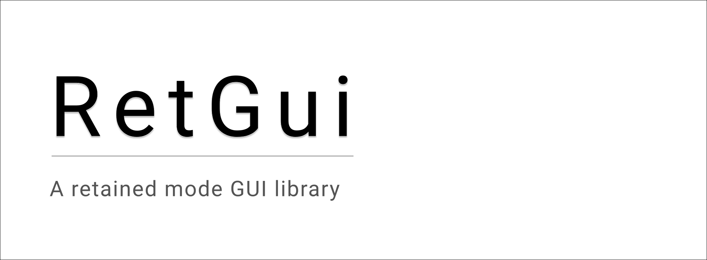
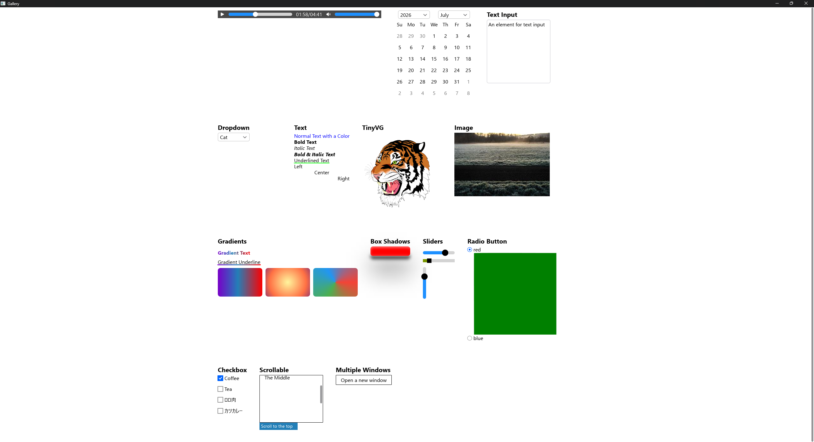
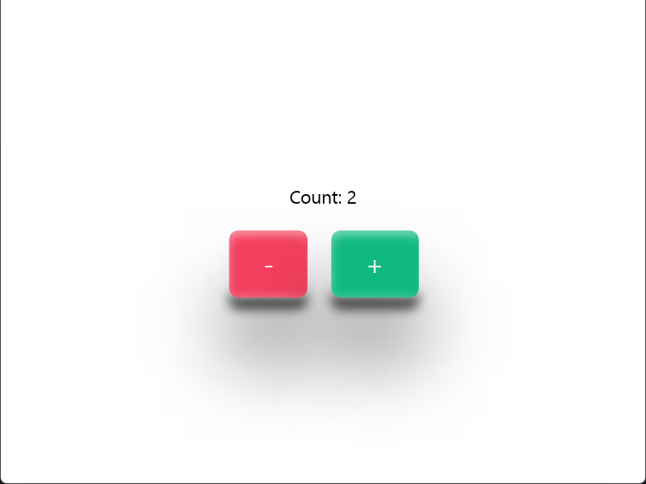

<p align="center"></p>

<p align="center">
  <a href="./LICENSE"></a>
  <a href="https://discord.gg/Atb8nuAub2"></a>
</p>

## Introduction
RetGui is a Rust library for creating desktop user interfaces.

## Installation
Add the following to your `Cargo.toml`:
```toml
[dependencies.retgui]
git = "https://github.com/RetGui/RetGui"
default-features = false
features = ["system_fonts", "vello_hybrid_renderer"]
```

## Example

```rust
use std::cell::RefCell;
use std::rc::Rc;

use retgui::elements::{Container, Element, Text, Window};
use retgui::events::ui_events::pointer::PointerButton;
use retgui::style::{AlignItems, FlexDirection, JustifyContent};
use retgui::{Color, RetGuiOptions, pct, px, rgb};

fn create_button(label: &str, base_color: Color, delta: i64, state: Rc<RefCell<i64>>, count_text: Text) -> Container {
    Container::new()
        .border_width(px(1), px(2), px(3), px(4))
        .border_color_all(rgb(0, 0, 0))
        .border_radius_all((10.0, 10.0))
        .padding(px(15), px(30), px(15), px(30))
        .justify_content(JustifyContent::Center)
        .background_color(base_color)
        .on_click(move |event| {
            *state.borrow_mut() += delta;
            count_text.clone().text(&format!("Count: {}", state.borrow()));
            event.stop_propagation();
        })
        .push(Text::new(label).font_size(24.0).color(Color::WHITE).selectable(false))
}

fn main() {
    let count = Rc::new(RefCell::new(0));
    let count_text = Text::new(&format!("Count: {}", count.borrow()));

    Window::new("Counter")
        .flex_direction(FlexDirection::Column)
        .justify_content(JustifyContent::Center)
        .align_items(AlignItems::Center)
        .width(pct(100))
        .height(pct(100))
        .gap(px(20), px(20))
        .push(count_text.clone())
        .push({
            Container::new()
                .gap(px(20), px(20))
                .push(create_button(
                    "-",
                    rgb(244, 67, 54),
                    -1,
                    count.clone(),
                    count_text.clone(),
                ))
                .push(create_button(
                    "+",
                    rgb(76, 175, 80),
                    1,
                    count.clone(),
                    count_text.clone(),
                ))
        });

    retgui::retgui_main(RetGuiOptions::basic("Counter"));
}
```

## Supported Platforms
| Platform | Status                             | Accessibility Status |
|----------|------------------------------------|----------------------|
| Windows  | Officially supported               | In Progress          |
| macOS    | Officially supported               | Planned              |
| Linux    | Officially supported               | Planned              |
| Web      | Runs, but not officially supported | TBD                  |
| Android  | Runs, but not officially supported | TBD                  |
| iOS      | Runs, but not officially supported | TBD                  |

## Features
| Feature               | Description                                                                 | Platforms Not Supported |
|-----------------------|-----------------------------------------------------------------------------|-------------------------|
| audio                 | Enables playing audio via MiniAudio.                                        | Web, Android, and iOS   |
| clipboard             | Enables clipboard support in text elements.                                 |                         |
| vello_cpu_renderer    | Enables the Vello CPU renderer.                                             |                         |
| vello_hybrid_renderer | Enables the Vello Hybrid renderer.                                          |                         |
| http_client           | Enables the HTTP client, which allows loading resources from URLs and more. |                         |
| system_fonts          | Tells the font engine to load system fonts automatically.                   |                         |
| png                   | Enables decoding PNG images.                                                |                         |
| jpeg                  | Enables decoding JPEG images                                                |                         |
| markdown              | Provides the ability to render markdown via an element.                     |                         |
| link                  | Allows opening links with your default browser.                             |                         |

## Showcase
<p>
  
  
</p>

## FAQ
### 1. Are Android, iOS, and the Web Supported? 
RetGui can run on those platforms, but they are not officially supported. We would like to support those platforms, but it requires a lot of platform integration. Please use SwiftUI, Jetpack Compose, Flutter, and etc.

### 2. Why do I have to clone an `Element` into a separate variable before using it in a callback?
`Element` is `Clone`, but not `Copy`, so it requires a clone. Luckily, there is a Rust project goal for improving the ergonomics, so that an explicit clone is not required:
https://github.com/rust-lang/rust-project-goals/issues/107

## License
Distributed under the Unlicense License. See the [LICENSE](./LICENSE) for more information.
