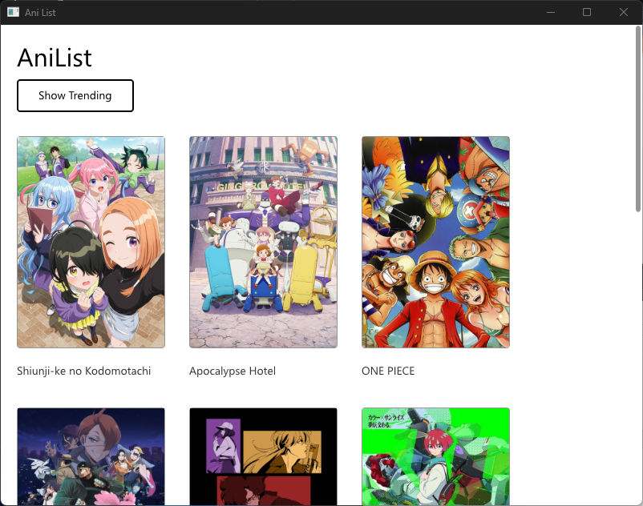
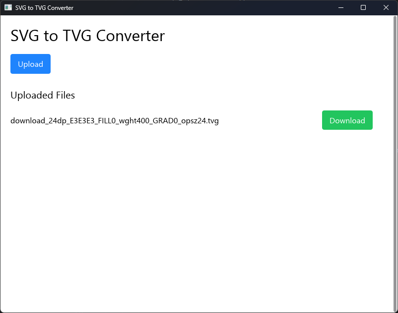

# 📜 Craft
[](https://github.com/craft-gui/craft/actions/workflows/ci.yml)
[](./LICENSE)
[](https://discord.gg/Atb8nuAub2)

Craft is a reactive GUI. Views are created using Components and Elements.
Updates are performed by handling messages from a Component.

<p align="center">
  
  
</p>
<p align="center">
  
  
</p>

### Counter

```rust
use craft::components::{Context, Component, ComponentSpecification};
use craft::elements::{Container, ElementStyles, Text};
use craft::events::ui_events::pointer::PointerButtonUpdate;
use craft::style::FlexDirection;

#[derive(Default)]
pub struct Counter {
    count: i64,
}

impl Component for Counter {
    type GlobalState = ();
    type Props = ();
    type Message = ();

    fn view(context: &mut Context<Self>) -> ComponentSpecification {
        fn button(label: &str, delta: i64) -> Container {
            Container::new()
                .on_pointer_up(move |c: &mut Context<Counter>, _: &PointerButtonUpdate| {
                    c.state_mut().count += delta;
                })
                .push(Text::new(label).disable_selection().padding(10, 10, 10, 10))
        }

        Container::new()
            .push(Text::new(&format!("Count: {}", context.state().count)).disable_selection())
            .flex_direction(FlexDirection::Column)
            .push(
                Container::new()
                    .flex_direction(FlexDirection::Row)
                    .push(button("-", -1))
                    .push(button("+", 1))
            ).component()
    }
}

fn main() {
    craft::craft_main(Counter::component(), (), craft::CraftOptions::basic("Counter"));
}

```

## Goals

* Reactive
* Components
* Pure Rust without procedural macros
* Web-like styling
* Cross Platform

# Features

* ✅ Reactive Components
* ✅ Async Updates
* ✅ Text Rendering
* ✅ Windows/Linux
* ✅ Android(basic)
* ✅ Web(basic)
* ✅ Image Support
* ✅ DPI Scaling Support
* ⬜️ Transform (Rotation, Skew, Scale) Support
* ✅ Mac
* ⬜️ iOS
* ✅ Text Input (Basic)
* ✅ IME Support (Basic)
* ⬜️ Animations
* ✅ Scrollables (Basic)
* ⬜️ Documentation
* ⬜️ Tests
* ⬜ Videos
* ⬜ SVGs
* ✅ Accessibility (Very Basic)

## Run Examples:

```shell
cargo run --package counter
```
